## Financial Firewall: Credit Card Security AI 🤖

The aim of a credit card fraud prediction project is to develop a machine learning system that can accurately predict which credit card users are likely to default on their payments in the future and fraudulent transaction. The system will use historical data of credit card users such as their payment history, credit limit, age, education, and other demographic information to identify patterns and trends that can help predict default behavior and many other attributes related to trasaction to identify the fraudulent transactions accurately.

Overall, credit card fraud safety systems are an important tool for lenders to manage risk and ensure the stability of the credit card industry. It relies on sophisticated machine learning algorithms to analyze large volumes of historical data and make accurate predictions about such fraudulent activities.

<details open="open">
  <summary>Table of Contents</summary>
  <ol>
    <li>
      <a href="#Approach">Approach</a>
    </li>
    <li>
      <a href="#Features">Features</a>
    </li>
    <li>
      <a href="#Technologies">Technologies</a>
    </li>
    <li>
      <a href="#Prototype">Protoype</a>
    </li>
    <li>
	    <a href = "#How-to-Start-Project">How to Start Project</a>
    </li>
    <li>
	    <a href = "#Contact-Us">Contact Us</a>
    </li>
    <li>
	    <a href = "#License">License</a>
    </li>
  </ol>
</details>

## Approach
Our system is basically trained on historical data related to credit card users to identify such fraudulent activities. There are many attributes that helps to achieve the objective such as demographic information, payment history, repayment status etc. to predict their default status in future and various transaction related attributes to determine the nature of the transaction.

## Features
This AI enabled solution has the potential to:
- Reduce the number of fraudulent transections and credit card defaulters.
- Reduce the financial losses for the lenderers and other financial institutions.
- Improve the overall security of credit card users.

## Technologies and Frameworks
- Python
- Streamlit
- Catboost
- Scikit-Learn

## Prototype:
<div style="display:flex; flex-wrap:wrap; gap:2%; justify-content:center;">
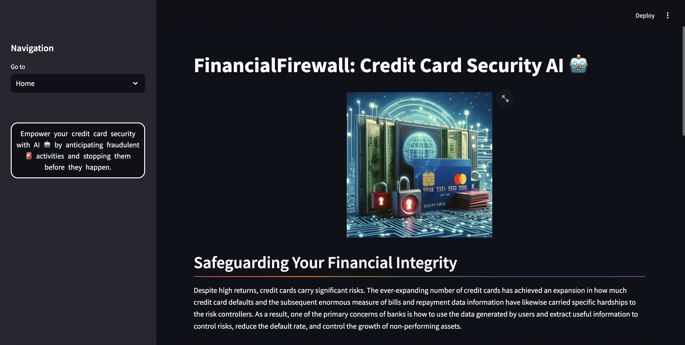
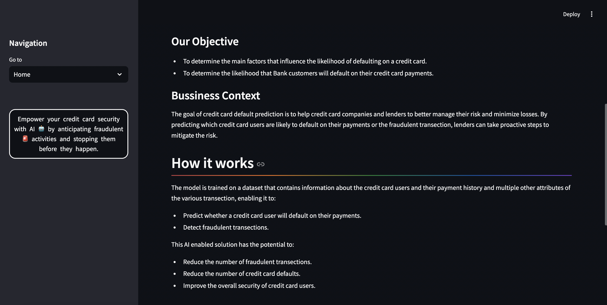
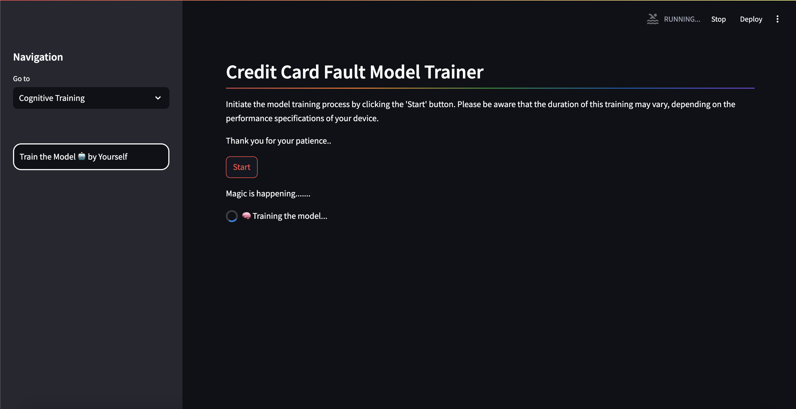
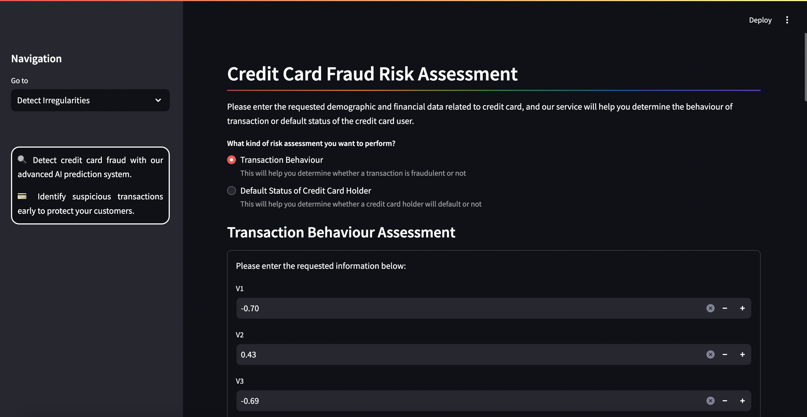
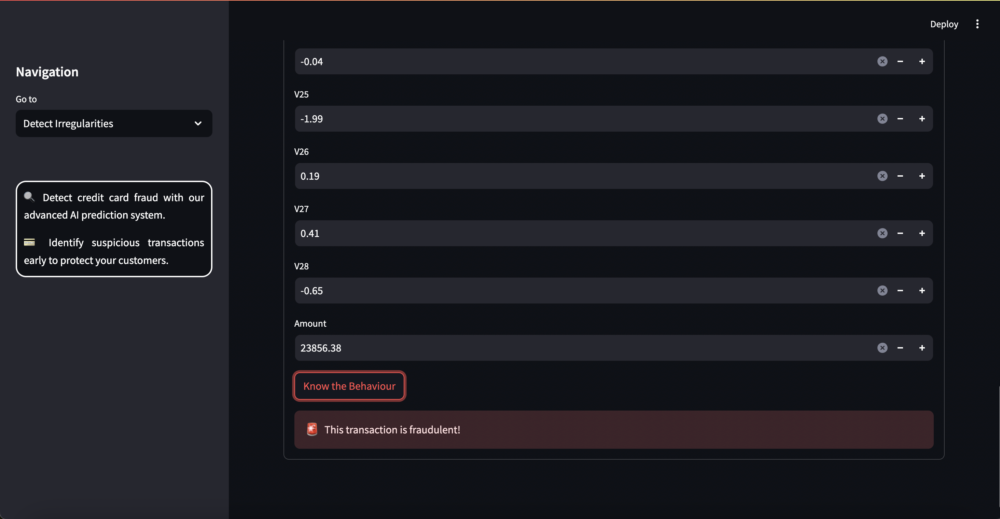
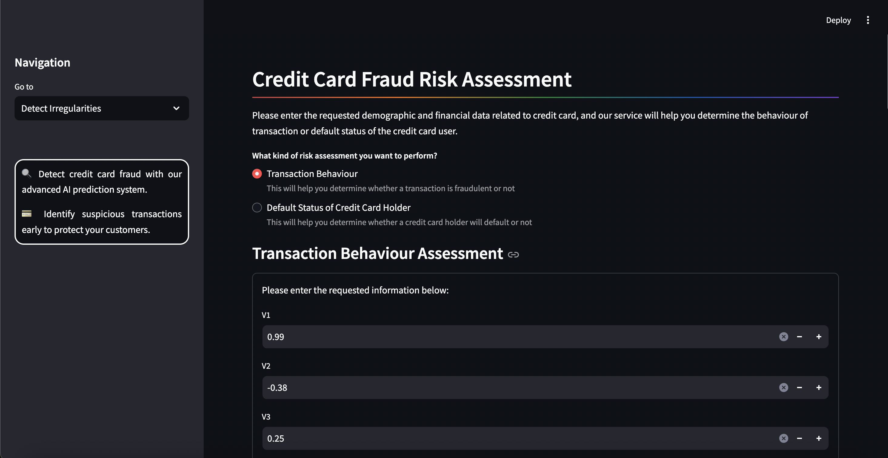
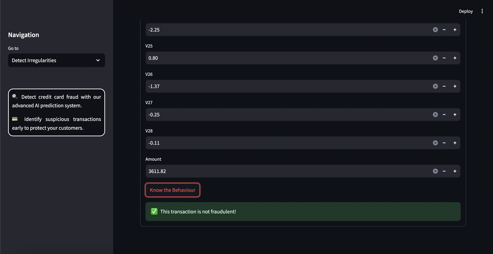
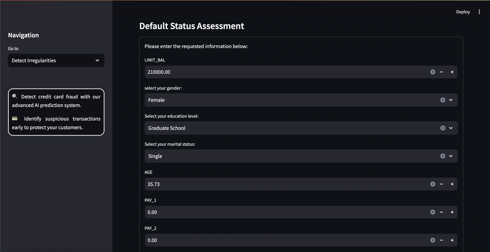
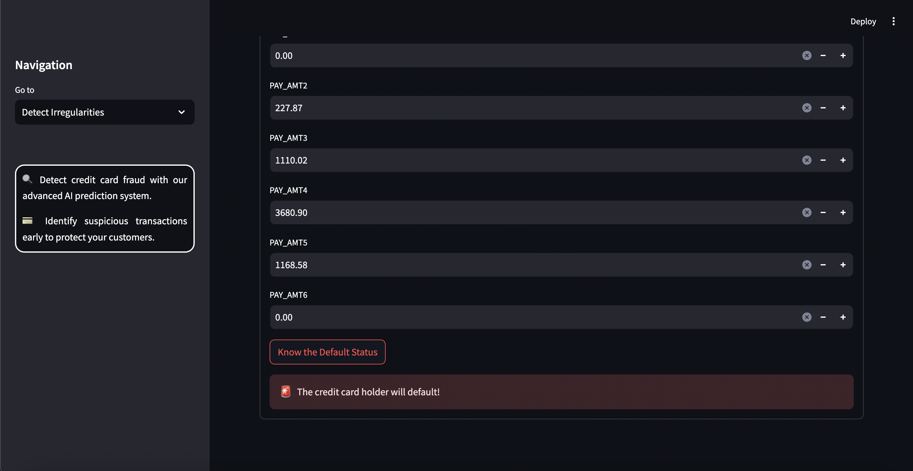
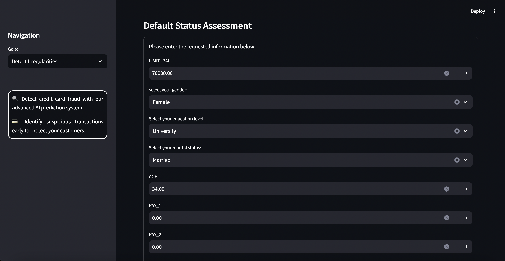
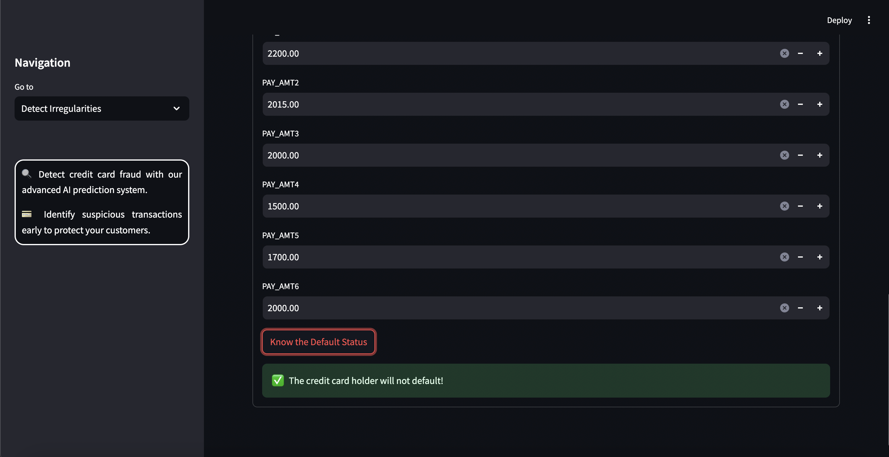
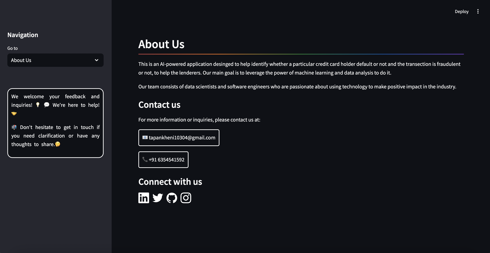
</div>

## How to Start Project
Follow these steps to get started with the project:

1. **Clone the Repository:**
   ```bash
   git clone <repository_link>
   ```
2. **Install Anaconda:**
   
   Make sure you have Anaconda installed on your system. If not, you can download and install it from the official website: https://www.anaconda.com/download/
   
4. **Create a Virtual Environment:**
   
   Create a new virtual environment using Python 3.11.5:

   ```bash
   conda create --name your_env_name python=3.11.5 -y
   ```
   Replace your_env_name with the desired name for your virtual environment.
   
   Activate the newly created environment:
   ```bash
   conda activate your_env_name
   ```
5. **Install Dependencies:**
   
   Install the project dependencies by running:
   ```bash
   pip install -r requirements.txt
   ```
   This command will install all the required packages listed in the requirements.txt file.

7. **Run the Streamlit App:**
   ```bash
   streamlit run app.py
   ```
   This command will start the Streamlit app.

## Contact Us
To learn more about our system and how it can help to reduce cost, please reach out:

📧 tapankheni10304@gmail.com

## License
This project is licensed under the MIT License - see the [LICENSE](LICENSE) file for details.
